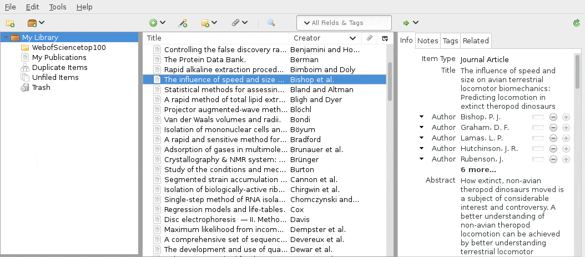

# theliterature-zotero
A Zotero plugin for auto-fetching pdfs from Sci-Hub

Adds an entry to the context menu to fetch a PDF from sci-hub. Click and wait a few seconds, and you'll get a PDF!

* Tests sci-hub mirrors to find one that is responding
* Searches Crossref to find missing DOIs
* Automatically requests PDFs from sci-hub and imports into the Zotero library
* Handles captcha challenges from sci-hub

## Installation

## Development

## TODO

Creative Commons Zero v1.0 Universal 	cc0-1.0
